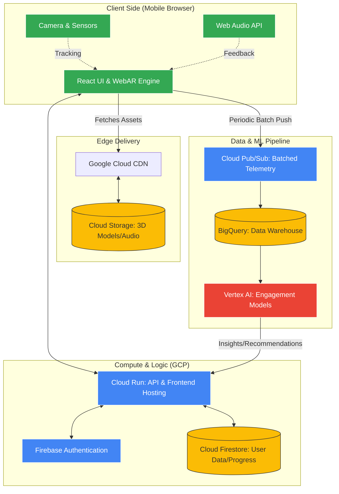
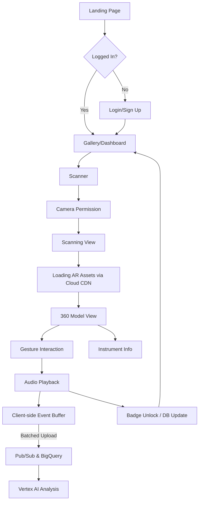

# Product Requirements Document: EchoMuse AR

## 1. Project Overview
**EchoMuse AR** is an interactive WebAR application designed to enhance the museum experience by allowing visitors to engage with traditional musical instruments. By scanning QR codes located near physical exhibits, users can "unlock" high-fidelity 3D models of instruments, view them in 360°, and simulate playing them through gesture-based interactions.

### 1.1 Vision
To bridge the gap between physical museum exhibits and interactive education, making cultural history tangible and audible through accessible web technology.

---

## 2. Target Audience
*   **Museum Visitors:** Individuals looking for a deeper, more interactive layer to their visit.
*   **Students/Educators:** Users seeking educational content about musicology and history.
*   **Cultural Enthusiasts:** People interested in traditional instruments and global heritage.

---

## 3. User Stories
| ID | User Role | Requirement | Goal |
|:---|:---|:---|:---|
| US.1 | Visitor | Scan a QR code at a museum stand | To instantly view a 3D model of the instrument on my phone. |
| US.2 | Visitor | Rotate the 3D model in 360° | To see details of the instrument that might be hidden in the glass case. |
| US.3 | Visitor | Interact with the strings/heads | To hear what the instrument sounds like and understand how it is played. |
| US.4 | Learner | Read historical information | To gain context about the origin and significance of the instrument. |
| US.5 | Explorer | Track my progress in a gallery | To gamify the visit and ensure I haven't missed any exhibits. |

---

## 4. Functional Requirements
1.  **QR Scanning:** The system must scan and parse custom museum QR codes to trigger specific WebAR instrument models.
2.  **WebAR Rendering:** The system must render high-fidelity 3D models of instruments using a WebAR engine directly in the mobile browser.
3.  **360° Interaction:** The system must allow users to rotate, pan, and zoom the 3D models using standard touch gestures.
4.  **Gesture-Based Play:** The system must support gesture recognition (swipes for strings, taps for percussion, holds for wind) to simulate playing the instruments.
5.  **Low-Latency Audio:** The system must provide instant, low-latency audio feedback corresponding to user gestures and interactions.
6.  **User Authentication:** The system must allow users to create accounts and log in securely via email or social providers.
7.  **Instrument Gallery:** The system must display a gallery differentiating between "Discovered" instruments and "Locked" instruments.
8.  **Achievement System:** The system must track user interactions and award badges based on predefined milestones (e.g., "String Master").
9.  **Onboarding Tutorial:** The system must present an interactive tutorial for new users on how to scan codes and interact with AR models.
10. **Hardware Verification:** The system must verify device camera and WebAR compatibility before attempting to launch the AR experience, displaying an error if unsupported.

---

## 5. Non-Functional Requirements
1.  **Performance:** AR models and associated textures must load in under 3 seconds on a standard 4G mobile connection.
2.  **Accessibility:** The application interface must adhere to WCAG 2.1 AA standards, including high contrast ratios and support for screen readers on non-AR screens.
3.  **Scalability:** The backend infrastructure must auto-scale to support up to 10,000 concurrent users during peak museum hours without degradation in API response times.

---

## 6. Data Requirements
1.  **User Profiles:** The system must securely store user account details, preferences (haptics, audio quality), and authentication tokens.
2.  **Instrument Metadata:** The system must store and retrieve historical data, audio samples, and 3D model paths (GLB/GLTF) for each instrument.
3.  **Progress Tracking:** The system must maintain a persistent record of each user's discovered instruments and unlocked achievements.
4.  **Interaction Telemetry:** The system must capture timestamped interaction events (scans, playtime, model rotations) in a client-side buffer and transmit them in periodic batches for engagement analysis.
5.  **ML Training Data:** The system must aggregate anonymized, batched telemetry data to train machine learning models for predicting user engagement and recommending exhibits.

---

## 7. Architecture & Technical Strategy

### 7.1 Backend Architecture Diagram

### 7.2 Component Relationships
1.  **Frontend/Backend Delivery**: `Cloud Run` serves the React application. The client fetches heavy 3D assets (GLB) and audio samples from `Cloud Storage` via `Cloud CDN` for low-latency delivery.
2.  **User Management**: `Firebase Authentication` handles secure login, while `Firestore` stores persistent user states like discovered instruments and achievements.
3.  **Real-time Interaction**: The WebAR engine (8th Wall) interacts with `Cloud Run` APIs to validate QR codes and fetch instrument-specific metadata.
4.  **Batched Telemetry Pipeline**: User actions (scans, playtime, swipes) are captured locally and sent in periodic batches via `Pub/Sub` into `BigQuery`. This reduces network egress costs and preserves device battery life.
5.  **Intelligence Layer**: `Vertex AI` analyzes historical data in `BigQuery` to generate engagement scores and personalized recommendations.

---

## 8. User Flow

---

## 9. Success Metrics (KPIs)
1.  **Retention:** Percentage of users who return to the gallery after their first scan.
2.  **Engagement:** Average time spent interacting with a 3D model (measured via ML pipeline).
3.  **Completion Rate:** Number of users who unlock >5 instruments during a single visit.
4.  **Hardware Success:** Ratio of successful AR starts vs. "Unsupported Device" hits.
